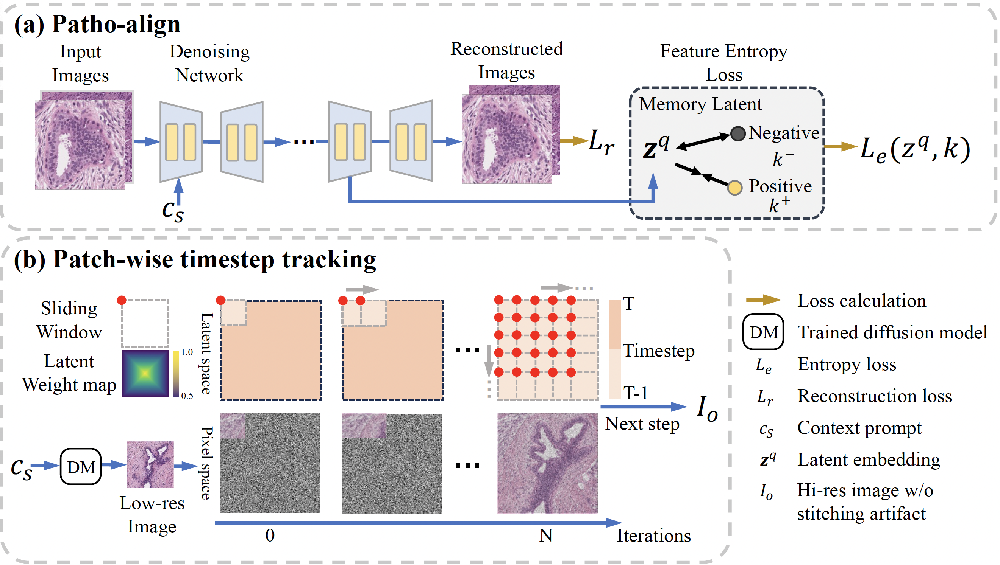

# PathUp: Patch-wise Timestep Tracking for Multi-class Large Pathology Image Synthesising Diffusion Model

Our proposed PathUp framework has two key components: (a) The Patho-align module, which integrates multi-class pathology images at various spatial levels along with textural descriptions $c_s$ into the latent diffusion model. Training is guided by a feature entropy loss, which leverages a memory latent to ensure that latents $\boldsymbol{z^q}$ from the same class exhibit closer distances. (b) To facilitate the generation of high-resolution images from low-resolution references without requiring additional training, we propose a patch-wise timestep tracking module. This module operates by individually denoising split latent patches and simultaneously removing tiling artifacts through the utilization of a latent weight map.

## Install requirements
use `pip install -r requirements.txt` to set up environments.

## Training

For training PathUp, we divide the pathology images into $512\times512$ patches as 'patch' scale. Additionally, we extract overview-level data by cutting images into large $2048\times2048$ patches as 'overview', which are subsequently resized to $512\times512$ dimensions. For each image, we allocate a prompt $c_s$, including the scale information ('overview' or 'patch'), and class conditions. After the dataset preparation, call `python train_PathoAlign.py` for training.

## Inference 
call `python test_PWTT.py` for a synthetic image.